<div align="center">

**🌐 Choose Language / Selecione o Idioma / Elija el Idioma**

[](README.md)&nbsp;&nbsp;&nbsp;[](README_PT.md)&nbsp;&nbsp;&nbsp;[](README_ES.md)

</div>

---

<div align="center">


# 🧮 CompendioCalc — Cross-Platform Scientific Formula Compendium & Calculator

**A .NET MAUI Blazor Hybrid app that catalogs 4,700+ formulas across 56 knowledge areas,**
**letting users browse, search, calculate, favorite, and review the history of any formula.**

<br>


</div>

---

## 📑 Table of Contents

<details>
<summary>▶️ <strong>Click to expand / collapse this section</strong></summary>

**🏗️ Project**
- [About the Project](#-about-the-project)
- [Main Features](#-main-features)
- [Knowledge Areas](#️-knowledge-areas)
- [Technology Stack](#️-technology-stack)
- [Implementation Highlights](#-implementation-highlights)
- [Repository Structure](#-repository-structure)
- [How to Run](#-how-to-run)
- [How to Contribute](#-how-to-contribute)
- [Author](#-author)
- [License](#-license)

**📋 Product & Engineering Documentation**
- [1. Requirements](#1-requirements)
- [2. UML Diagrams](#2-uml-diagrams)
- [3. Data Modeling](#3-data-modeling)
- [4. Architecture](#4-architecture)
- [5. Business Processes](#5-business-processes)
- [6. UX/UI & Prototypes](#6-uxui--prototypes)
- [7. Technical Documentation](#7-technical-documentation)
- [8. Project Management](#8-project-management)
- [9. Business Analysis](#9-business-analysis)
- [10. Security & Compliance](#10-security--compliance)

</details>

---

## 📖 About the Project

> **CompendioCalc** is an ambitious cross-platform app whose goal is to gather **10,000+ formulas and equations** from every area of human knowledge that involves mathematical calculation — from exact sciences to social sciences, health, arts, and beyond.

Built with **.NET 10 MAUI Blazor Hybrid**, the app runs from a single C# codebase on **Windows, Android, iOS, and macOS (Mac Catalyst)**. Each formula carries not only its symbolic expression and an executable calculation, but also historical context, creator attribution, bibliographic references, and the valid range for each variable — turning the app into both a **calculator** and an **encyclopedia**.

Currently the compendium has **4,703+ formulas across 56 knowledge areas**, organized into 9 content "volumes" plus 56 area-specific consolidated files, with an internal **bibliographic ingestion & audit pipeline** used to curate new formulas before they are merged into the catalog.

---

## ✨ Main Features

| Icon | Feature | Page / Component | Description |
|:-----:|:---------------|:----------------:|:----------|
| 🏠 | **Home / Dashboard** | `Home.razor` | Highlights compendium stats (total formulas, areas) and featured formulas. |
| 🗂️ | **Browse by Area/Category** | `Categorias.razor` | Drill down through 56 knowledge areas → categories → subcategories. |
| 🔎 | **Real-Time Search** | `Buscar.razor` | Searches across formula names, descriptions, creators, and codes as you type. |
| 🧮 | **Formula Calculator** | `FormulaCalc.razor` + `CalculadoraService` | Renders input fields for each variable, validates bounds, and runs the `Calcular` lambda to produce a result with unit. |
| ⭐ | **Favorites** | `Favoritos.razor` | Mark/unmark formulas as favorites for quick access. |
| 🕘 | **Calculation History** | `Historico.razor` | Logs every calculation performed (formula, inputs, result, timestamp). |
| ♿ | **Accessibility Settings** | `AccessibilitySettings.razor` + `AccessibilityService` | Adjustable font size, contrast, and layout rendering via `AccessibilityRenderer`. |
| 📥 | **Bibliographic Ingestion** | `FormulaService.BibliographicIngestion.cs` + `AuditoriaIngestao.razor` | Imports new formula candidates from JSONL batches into the curation pipeline. |
| 🧪 | **Compendium Audit** | `FormulaService.CompendioAudit.cs` | Validates official compendium codes (001–387) for completeness, uniqueness, and structure. |
| 🌍 | **Cross-Platform** | MAUI targets | One codebase running on Windows, Android, iOS, and macOS. |

---

## 🗺️ Knowledge Areas

The compendium currently covers **56 distinct knowledge areas**, spanning exact sciences, life sciences, engineering, humanities, arts, and computing — from Physics, Chemistry, and Mathematics to Law, Music/Acoustics, Robotics, and Artificial Intelligence. The full bilingual list is reproduced in [§1.4 Domain Requirements](#1-requirements).

---

## 🛠️ Technology Stack

| Technology | Role in the Project |
|:-----------|:------------------|
| **.NET 10** | Base runtime/SDK for the whole solution. |
| **.NET MAUI** | Cross-platform app shell (Windows, Android, iOS, macOS). |
| **Blazor Hybrid** | Razor components rendered in a native `BlazorWebView`. |
| **C#** | Language for models, services, and code-behind. |
| **Razor (`.razor`)** | UI components — `Home`, `Categorias`, `Buscar`, `Favoritos`, `Historico`, `FormulaCalc`, `AccessibilitySettings`, `AuditoriaIngestao`. |
| **CSS (custom theme tokens)** | Dark theme via `--bg-card`, `--text-primary`, `--border`, etc. |
| **JSONL** | Bibliographic batch seed/curation format (`Data/BibliographicBatches/*.jsonl`). |
| **Python (auxiliary scripts)** | `analyze_report.py`, `audit_parser_safe.py` for offline analysis of audit/curation reports. |

### 🎯 Platform Targets

| Platform | Target Framework |
|:---------|:------------------|
| Windows | `net10.0-windows10.0.19041.0` |
| Android | `net10.0-android` |
| iOS | `net10.0-ios` |
| macOS (Mac Catalyst) | `net10.0-maccatalyst` |

---

## 🔑 Implementation Highlights

### 📐 The `Formula` Data Model

> Every entry in the compendium — regardless of knowledge area — shares the same rich model, combining a symbolic expression, an **executable C# lambda**, historical metadata, and bounded input variables.

```csharp
public class Formula {
    public string Id { get; set; }              // e.g. "C2501", "mec001", "qc_11"
    public string CodigoCompendio { get; set; }  // Official compendium code 001–387
    public string Nome { get; set; }             // Formula name
    public string Categoria { get; set; }        // Top-level category
    public string SubCategoria { get; set; }     // Subcategory
    public string Expressao { get; set; }        // Symbolic expression (LaTeX-style)
    public string Descricao { get; set; }        // Description with historical context
    public string Criador { get; set; }          // Creator / discoverer
    public string AnoOrigin { get; set; }        // Year of origin
    public string ReferenciaBibliografica { get; set; }
    public List<Variavel> Variaveis { get; set; }
    public Func<Dictionary<string, double>, double>? Calcular { get; set; }
    public string VariavelResultado { get; set; }
    public string UnidadeResultado { get; set; }
    public bool Favorita { get; set; }
}

public class Variavel {
    public string Simbolo { get; set; }
    public string Nome { get; set; }
    public string Unidade { get; set; }
    public double ValorPadrao { get; set; }
    public double ValorMin { get; set; }
    public double ValorMax { get; set; }
}
```

### 🔄 Calculation Flow

```
👆 User opens a formula on FormulaCalc.razor
          ↓
📋 The "Calcular" tab renders one input per Variavel (symbol, name, unit, bounds)
          ↓
✍️ User fills in values (defaults pre-filled from ValorPadrao)
          ↓
✅ CalculadoraService validates each value against ValorMin/ValorMax
          ↓
🧮 Formula.Calcular(Dictionary<string,double>) executes the symbolic expression
          ↓
📊 Result is displayed with VariavelResultado + UnidadeResultado
          ↓
🕘 The calculation is appended to Historico (formula, inputs, result, timestamp)
```

---

## 📂 Repository Structure

```plaintext
CompendioCalc/
│
├── 📄 CompendioCalc.sln / CompendioCalc.csproj   # ⚙️  Solution & project files (multi-target)
├── 📄 MauiProgram.cs                              # 🚀 App bootstrap + DI registration
├── 📄 App.xaml / App.xaml.cs                      # 🖼️  MAUI application shell
├── 📄 MainPage.xaml / MainPage.xaml.cs            # 🖼️  Hosts the BlazorWebView
├── 📄 ACCESSIBILITY.md                            # ♿ Accessibility guidelines & checklist
├── 📄 analyze_report.py / audit_parser_safe.py    # 🐍 Offline audit/report analysis scripts
│
├── 📁 Models/
│   ├── 📄 Formula.cs                  # 🧩 Formula + Variavel entities ← CORE
│   └── 📄 CompendioRelatorio.cs       # 📊 Audit report entity
│
├── 📁 Services/
│   ├── 📄 FormulaService.cs                       # 🧠 DI orchestrator ← CORE
│   ├── 📄 FormulaService.CompendioAudit.cs        # 🧪 Compendium codes 001–387 audit
│   ├── 📄 FormulaService.BibliographicIngestion.cs # 📥 Bibliographic batch ingestion
│   ├── 📄 FormulaService.CurationPipeline.cs      # 🧹 Curation pipeline (review/merge)
│   ├── 📄 FormulaService.MillionCanonical.cs      # 📚 Canonical large-scale catalog support
│   ├── 📄 FormulaGeneradorFaltantes.cs            # ➕ Generator for missing formulas
│   ├── 📄 CalculadoraService.cs                   # 🧮 Validates inputs & runs Calcular
│   ├── 📄 AccessibilityService.cs                 # ♿ Accessibility preferences
│   ├── 📄 FormulaService_Vol*.cs                  # 📚 Volumes I–IX content
│   └── 📄 FormulaServiceConsolidadas_[Area].cs    # 🗂️ 56 area-specific catalogs
│
├── 📁 Components/
│   ├── 📄 App.razor / Routes.razor / _Imports.razor
│   ├── 📁 Layout/
│   │   ├── 📄 MainLayout.razor          # 🖼️ App shell layout (nav + content)
│   │   └── 📄 AccessibilityRenderer.razor # ♿ Wraps content with accessibility styles
│   └── 📁 Pages/
│       ├── 📄 Home.razor
│       ├── 📄 Categorias.razor
│       ├── 📄 Buscar.razor
│       ├── 📄 Favoritos.razor
│       ├── 📄 Historico.razor
│       ├── 📄 FormulaCalc.razor          # 🧮 Formula detail + calculator ← CORE
│       ├── 📄 AccessibilitySettings.razor
│       └── 📄 AuditoriaIngestao.razor
│
├── 📁 Data/BibliographicBatches/
│   ├── 📄 0001_seed.jsonl                # 🌱 Seed batch of candidate formulas
│   ├── 📄 prepare_history.json
│   ├── 📄 last_prepare_report.json
│   └── 📄 README.md
│
├── 📁 Platforms/
│   ├── 📁 Android/MainActivity.cs
│   └── 📁 Windows/App.xaml.cs
│
└── 📁 wwwroot/
    └── 📄 index.html
```

---

## 🚀 How to Run

### 📋 Prerequisites

| Requirement | Detail |
|:----------|:--------|
| **.NET 10 SDK** | [dotnet.microsoft.com/download/dotnet/10.0](https://dotnet.microsoft.com/download/dotnet/10.0) |
| **MAUI workload** | `dotnet workload install maui` |
| **Android Studio + SDK** | Required for the Android target |
| **Xcode** (macOS only) | Required for iOS / macOS targets |

### 🔧 Step by Step

**1. Clone the repository:**

```bash
git clone https://github.com/VictorHJesusSantiago/CompendioCalc.git
cd CompendioCalc/CompendioCalc
```

**2. Restore dependencies:**

```powershell
dotnet restore
```

**3. Run on your target platform:**

```powershell
# Windows
dotnet run -f net10.0-windows10.0.19041.0

# Android
dotnet run -f net10.0-android

# iOS
dotnet run -f net10.0-ios

# macOS
dotnet run -f net10.0-maccatalyst
```

**4. Explore the app:**

```
Home → Categorias / Buscar → pick a formula → FormulaCalc → "Calcular" tab → enter values → see result
```

---

## 🤝 How to Contribute

| Step | Action | Command |
|:-----:|:-----|:--------|
| 1️⃣ | **Fork** | Create a fork of the repository. | — |
| 2️⃣ | **Branch** | Create a feature branch from `main`. | `git checkout -b feature/NewArea` |
| 3️⃣ | **Add Formulas** | Add new formulas in `Services/FormulaServiceConsolidadas_[Area].cs` (or create a new area file), each with `Descricao`, `Criador`, `AnoOrigin`, a working `Calcular` lambda, and at least one `Variavel`. | — |
| 4️⃣ | **Register** | If you added a new area, register it in `FormulaService_ConsolidatedAreasCatalogLoader.cs`. | — |
| 5️⃣ | **Commit & Push** | Save changes with a clear, semantic message and push the branch. | `git commit -m 'feat: add Geophysics formulas'` |
| 6️⃣ | **Pull Request** | Open a PR describing the changes. | — |

<div align="center">

**If this project was useful for your studies, leave a ⭐️ on the repository!**

</div>

---

## 👨‍💻 Author

<div align="center">

**Victor H. J. Santiago**

[](https://github.com/VictorHJesusSantiago)
[](https://www.linkedin.com/in/victor-henrique-de-jesus-santiago/)

</div>

---

## 📄 License

<div align="center">

This project is distributed under the **MIT License**.
See the [`LICENSE`](./LICENSE) file in the repository for details.


</div>

---

# 📋 Product & Engineering Documentation

> The sections below document **CompendioCalc** using the same artifacts and notations applied to enterprise-grade projects (requirements engineering, UML, architecture, BPMN, UX, project management, security), **adapted to the real scope of this project**: a growing, single-developer, cross-platform scientific compendium and calculator with an internal data-curation pipeline.

---

## 1. Requirements

<details>
<summary>▶️ <strong>Click to expand / collapse this section</strong></summary>

### 1.1 Functional Requirements (FR)

| ID | Requirement |
|----|-------------|
| FR01 | The system shall display a Home screen with compendium statistics (total formulas, total areas) and featured formulas. |
| FR02 | The system shall allow browsing formulas hierarchically by Knowledge Area → Category → Subcategory (`Categorias.razor`). |
| FR03 | The system shall provide real-time search across formula name, description, creator, and code (`Buscar.razor`). |
| FR04 | The system shall display a formula detail page with tabs "Calcular", "Sobre" (About), and "Variáveis" (Variables). |
| FR05 | The system shall render one input field per `Variavel`, pre-filled with `ValorPadrao`, showing `Simbolo`, `Nome`, and `Unidade`. |
| FR06 | The system shall validate each entered value against `ValorMin`/`ValorMax` before calculation. |
| FR07 | The system shall execute `Formula.Calcular` with the entered values and display the result with `VariavelResultado` and `UnidadeResultado`. |
| FR08 | The system shall allow the user to mark/unmark a formula as favorite (`Favorita` flag), toggled via a ★/☆ button. |
| FR09 | The system shall display a Favorites page listing all formulas where `Favorita == true`. |
| FR10 | The system shall record every executed calculation (formula id, inputs, result, timestamp) in a History page. |
| FR11 | The system shall provide an Accessibility Settings page allowing the user to adjust font size and contrast. |
| FR12 | The system shall apply accessibility preferences globally via `AccessibilityRenderer`. |
| FR13 | The system shall support importing candidate formulas from JSONL bibliographic batches (`Data/BibliographicBatches/*.jsonl`). |
| FR14 | The system shall run a compendium audit validating official codes 001–387 for uniqueness and completeness (`FormulaService.CompendioAudit.cs`). |
| FR15 | The system shall expose an "Auditoria/Ingestão" page summarizing curation pipeline status. |
| FR16 | The system shall run on Windows, Android, iOS, and macOS from a single Blazor Hybrid codebase. |

### 1.2 Non-Functional Requirements (NFR)

| Category | ID | Requirement |
|----------|----|-------------|
| ⚡ Performance | NFR01 | Searching across 4,700+ formulas must return results perceived as instantaneous (< 100 ms client-side filtering). |
| 📈 Scalability | NFR02 | The architecture must support growth to 10,000+ formulas by adding new `FormulaServiceConsolidadas_[Area].cs` files without refactoring existing ones. |
| ♿ Accessibility | NFR03 | The UI must support adjustable font size and high-contrast mode via `AccessibilityService`/`AccessibilityRenderer`. |
| 🌍 Portability | NFR04 | The same Razor component codebase must run unmodified on Windows, Android, iOS, and macOS. |
| 🧩 Maintainability | NFR05 | Each knowledge area's formulas must be isolated in its own service file, loaded by a single orchestrator. |
| 🛡️ Reliability | NFR06 | `Formula.Calcular` must not throw for any input within `[ValorMin, ValorMax]`. |
| 🔍 Data Integrity | NFR07 | The compendium audit must detect duplicate or missing `CodigoCompendio` values in the 001–387 range. |
| 📴 Availability | NFR08 | Core browsing and calculation features must work fully offline (formula data is embedded in-memory). |
| 🌐 Localization | NFR09 | Domain content (formula names, descriptions) is primarily in Portuguese (pt-BR); UI strings should remain consistent with that language. |

### 1.3 Business Rules (RN)

| ID | Rule |
|----|------|
| RN01 | Every `Formula` must have non-empty `Id`, `Nome`, `Categoria`, `Expressao`, `Descricao`, `Criador`, `AnoOrigin`, `ReferenciaBibliografica`, at least one `Variavel`, and a working `Calcular` lambda. |
| RN02 | `CodigoCompendio` values in the 001–387 range are reserved for the "official compendium" core and must be unique. |
| RN03 | For every `Variavel` with bounds defined, `ValorMin ≤ ValorPadrao ≤ ValorMax` must hold. |
| RN04 | Favorites and history are local-only, per-device, and require no user account. |
| RN05 | New formulas must pass the curation pipeline (`FormulaService.CurationPipeline.cs`) before being merged into a `FormulaServiceConsolidadas_[Area]` file. |

### 1.4 Domain Requirements

| ID | Requirement |
|----|-------------|
| DOM01 | Each formula's `Expressao` must use standard scientific/mathematical notation (LaTeX-style symbols). |
| DOM02 | Each formula's `Descricao` must include historical/origin context where available. |
| DOM03 | Every formula must be classified under one of the 56 recognized knowledge areas (see table below). |
| DOM04 | Units (`Unidade`, `UnidadeResultado`) must follow SI conventions where applicable, with domain-specific units (e.g., dB, cents, QALY) allowed where standard in that field. |

<details>
<summary>📚 Full list of 56 Knowledge Areas</summary>

| # | Area | # | Area |
|---|---|---|---|
| 1 | Physics (Física) | 29 | Computer Science (Computação) |
| 2 | Chemistry (Química) | 30 | Quantum Computing (Computação Quântica) |
| 3 | Mathematics (Matemática) | 31 | Communication (Comunicação) |
| 4 | Biology (Biologia) | 32 | Law (Direito) |
| 5 | Engineering (Engenharia) | 33 | Administration (Administração) |
| 6 | Statistics (Estatística) | 34 | Education (Educação) |
| 7 | Economics (Economia) | 35 | Environmental Science (Meio Ambiente) |
| 8 | Medicine (Medicina) | 36 | Astronomy (Astronomia) |
| 9 | Geography (Geografia) | 37 | Anthropology (Antropologia) |
| 10 | Philosophy (Filosofia) | 38 | Music / Acoustics (Música) |
| 11 | Sociology (Sociologia) | 39 | Civil Engineering (Engenharia Civil) |
| 12 | Psychology (Psicologia) | 40 | Electrical Engineering (Engenharia Elétrica) |
| 13 | Arts (Artes) | 41 | Chemical Engineering (Engenharia Química) |
| 14 | Pharmacy (Farmácia) | 42 | Biomedical Engineering (Engenharia Biomédica) |
| 15 | Nutrition (Nutrição) | 43 | Materials Science (Ciência dos Materiais) |
| 16 | Veterinary Medicine (Veterinária) | 44 | Computer Engineering (Engenharia de Computação) |
| 17 | Epidemiology (Epidemiologia) | 45 | Petroleum Engineering (Engenharia de Petróleo) |
| 18 | Medical Genetics (Genética Médica) | 46 | Production Engineering (Engenharia de Produção) |
| 19 | Neuroscience (Neurociências) | 47 | Mechanical Engineering (Engenharia Mecânica) |
| 20 | Public Health (Saúde Pública) | 48 | Environmental Engineering (Engenharia Ambiental) |
| 21 | Oceanography (Oceanografia) | 49 | Materials Engineering (Engenharia de Materiais) |
| 22 | Astrophysics (Astrofísica) | 50 | Geophysics (Geofísica) |
| 23 | Bioinformatics (Bioinformática) | 51 | Paleontology (Paleontologia) |
| 24 | Biotechnology (Biotecnologia) | 52 | Robotics (Robótica) |
| 25 | Data Science (Ciência de Dados) | 53 | Computer Vision (Visão Computacional) |
| 26 | Information Security (Segurança da Informação) | 54 | Artificial Intelligence (IA) |
| 27 | Sports Science (Esportes) | 55 | Sustainability (Sustentabilidade) |
| 28 | Innovation & Technology (Inovação Tecnológica) | 56 | Analytical Chemistry (Química Analítica) |

</details>

### 1.5 Data Requirements

| ID | Requirement |
|----|-------------|
| DATA01 | `Formula` entity stores expression, metadata, bibliographic reference, and an executable `Calcular` delegate (see [Implementation Highlights](#-implementation-highlights)). |
| DATA02 | `Variavel` entity stores symbol, name, unit, default value, and valid range (`ValorMin`/`ValorMax`). |
| DATA03 | `CompendioRelatorio` entity stores audit results (totals, duplicates, missing codes, per-area counts). |
| DATA04 | Bibliographic batches (`Data/BibliographicBatches/*.jsonl`) store candidate formulas pending curation, one JSON object per line. |
| DATA05 | `prepare_history.json` / `last_prepare_report.json` store the curation pipeline's run history and latest report. |

### 1.6 Interface Requirements

| ID | Requirement |
|----|-------------|
| UI01 | All screens are Razor components rendered inside a `BlazorWebView` (`MainLayout.razor`). |
| UI02 | The UI uses a dark theme based on CSS custom properties (`--bg-card`, `--text-primary`, `--text-secondary`, `--text-muted`, `--border`). |
| UI03 | The formula detail page (`FormulaCalc.razor`) uses a tabbed layout: "Calcular", "Sobre", "Variáveis". |
| UI04 | Breadcrumb navigation shows Area → Category on the formula detail page. |
| UI05 | `AccessibilityRenderer.razor` wraps page content to apply font-size/contrast preferences globally. |

### 1.7 Legal / Regulatory Requirements

| ID | Requirement |
|----|-------------|
| LEG01 | The project is distributed under the **MIT License**. |
| LEG02 | Scientific formulas represent public-domain knowledge; original creators/discoverers are credited via `Criador`/`AnoOrigin` for historical accuracy, not as a licensing claim. |
| LEG03 | The app collects no personal data; favorites and history are stored locally on-device only (relevant to [§10.4 LGPD/GDPR](#10-security--compliance)). |

### 1.8 User Stories

| ID | Story |
|----|-------|
| US01 | As a **student**, I want to search for a formula by name so that I can quickly find it during study. |
| US02 | As a **researcher**, I want to enter custom values into a formula so that I get an immediate numeric result with the correct unit. |
| US03 | As a **frequent user**, I want to favorite formulas I use often so that I can access them quickly from one place. |
| US04 | As a **user**, I want to see a history of my past calculations so that I can revisit previous results. |
| US05 | As a **visually-impaired user**, I want to increase font size and contrast so that the app is readable for me. |
| US06 | As a **maintainer**, I want to add new formulas in an isolated area file so that I don't risk breaking other areas. |
| US07 | As a **maintainer**, I want to run a compendium audit so that I can detect duplicate or missing official codes. |
| US08 | As a **curator**, I want to ingest a batch of candidate formulas from JSONL so that I can review them before merging. |

### 1.9 Epics

| ID | Epic | Related FRs |
|----|------|-------------|
| EP01 | Compendium Browsing & Search | FR01–FR04 |
| EP02 | Calculation Engine | FR05–FR07 |
| EP03 | Personalization (Favorites & History) | FR08–FR10 |
| EP04 | Accessibility | FR11–FR12 |
| EP05 | Data Curation & Bibliographic Ingestion | FR13–FR15 |
| EP06 | Cross-Platform Delivery | FR16 |

### 1.10 Features

| Feature | Epic | Description |
|---------|------|-------------|
| Area/Category Browser | EP01 | Hierarchical navigation through 56 areas. |
| Live Search | EP01 | Instant filtering as the user types. |
| Formula Calculator | EP02 | Bounded variable inputs + lambda execution. |
| Favorites List | EP03 | Quick access to starred formulas. |
| Calculation History | EP03 | Chronological log of past calculations. |
| Accessibility Panel | EP04 | Font size & contrast controls. |
| Bibliographic Ingestion | EP05 | Import JSONL candidate batches. |
| Compendium Audit | EP05 | Validate codes 001–387. |

### 1.11 Use Cases

| ID | Use Case | Primary Actor |
|----|----------|----------------|
| UC01 | Search Formula | User |
| UC02 | Browse by Area/Category | User |
| UC03 | Calculate Formula Result | User |
| UC04 | Manage Favorites | User |
| UC05 | View Calculation History | User |
| UC06 | Configure Accessibility | User |
| UC07 | Ingest Bibliographic Batch | Curator |
| UC08 | Run Compendium Audit | Curator |

### 1.12 Acceptance Criteria

| Use Case | Acceptance Criteria |
|----------|----------------------|
| UC03 — Calculate Formula Result | Given a formula with N variables, when the user fills all N inputs within `[ValorMin, ValorMax]` and taps "Calcular", then the system displays a numeric result with `UnidadeResultado` and appends an entry to History. |
| UC04 — Manage Favorites | Given a formula detail page, when the user taps the ☆ icon, then the icon changes to ★ and the formula appears on the Favorites page; tapping ★ reverses this. |
| UC08 — Run Compendium Audit | Given the compendium dataset, when the audit runs, then a `CompendioRelatorio` is produced listing total formulas, codes 001–387 coverage, and any duplicates/gaps. |

### 1.13 BDD Scenarios

```gherkin
Feature: Formula calculation

  Scenario: Successful calculation within bounds
    Given the user opens the "Lei de Hooke" formula
    And all variables have values within their valid range
    When the user taps "Calcular"
    Then the result is displayed with its unit
    And the calculation is added to the history

  Scenario: Out-of-range input
    Given the user opens a formula with a variable bounded between ValorMin and ValorMax
    When the user enters a value outside that range
    Then the system highlights the field as invalid
    And does not execute the calculation
```

### 1.14 Product Backlog (excerpt)

| Priority | Item |
|----------|------|
| High | Reach 10,000+ formulas (currently 4,703+) |
| High | Complete compendium audit for codes 001–387 |
| Medium | Expand bibliographic ingestion pipeline with automated validation |
| Medium | Add export of calculation history |
| Low | Add formula-of-the-day widget on Home |
| Low | Add unit-conversion helper inside the calculator |

### 1.15 Glossary

| Term | Definition |
|------|------------|
| **Fórmula (Formula)** | A catalog entry combining expression, metadata, and an executable calculation. |
| **Variável (Variavel)** | An input or output quantity of a formula, with symbol, unit, and valid range. |
| **Código Compendio** | Official numeric code (001–387) identifying core compendium formulas. |
| **Área de Conhecimento** | One of the 56 top-level knowledge domains (e.g., Physics, Law, Music). |
| **Volume** | One of 9 historical content batches (Vol. I–IX) of formulas. |
| **Curation Pipeline** | The review process candidate formulas go through before being merged. |
| **Compendium Audit** | Automated validation of code coverage and data completeness. |

### 1.16 Traceability Matrix

| FR | Use Case | UML Diagram | Test Type |
|----|----------|-------------|-----------|
| FR03 | UC01 | [2.4 Sequence](#2-uml-diagrams) | Unit + UI |
| FR06–FR07 | UC03 | [2.4 Sequence](#2-uml-diagrams), [2.7 State Machine](#2-uml-diagrams) | Unit |
| FR08–FR09 | UC04 | [2.7 State Machine](#2-uml-diagrams) | UI |
| FR14 | UC08 | [2.6 Activity](#2-uml-diagrams) | Integration |

### 1.17 Software Requirements Specification (SRS) — Summary

> Follows an IEEE 830-inspired structure: (1) Introduction — purpose, scope (cross-platform formula compendium/calculator); (2) Overall Description — product perspective (standalone MAUI app, no backend), user classes (students, researchers, professionals, curators); (3) Specific Requirements — see §1.1–§1.7; (4) Appendices — Glossary (§1.15), Knowledge Areas table (§1.4).

### 1.18 Vision Document

> **Vision:** For anyone who needs to look up or compute a scientific/technical formula, CompendioCalc is a cross-platform app that provides a single, searchable, calculation-ready compendium — unlike scattered PDFs, textbooks, or single-purpose calculator apps — by combining 10,000+ formulas (target) with executable calculators, historical context, and offline availability.

### 1.19 Prioritization Matrix (MoSCoW)

| Priority | Items |
|----------|-------|
| **Must Have** | Formula browsing, search, calculator with bounds validation, favorites |
| **Should Have** | Calculation history, accessibility settings, compendium audit |
| **Could Have** | Bibliographic ingestion UI, formula-of-the-day, export history |
| **Won't Have (now)** | User accounts/cloud sync, multi-language formula descriptions |

</details>

---

## 2. UML Diagrams

<details>
<summary>▶️ <strong>Click to expand / collapse this section</strong></summary>

### 2.1 Use Case Diagram

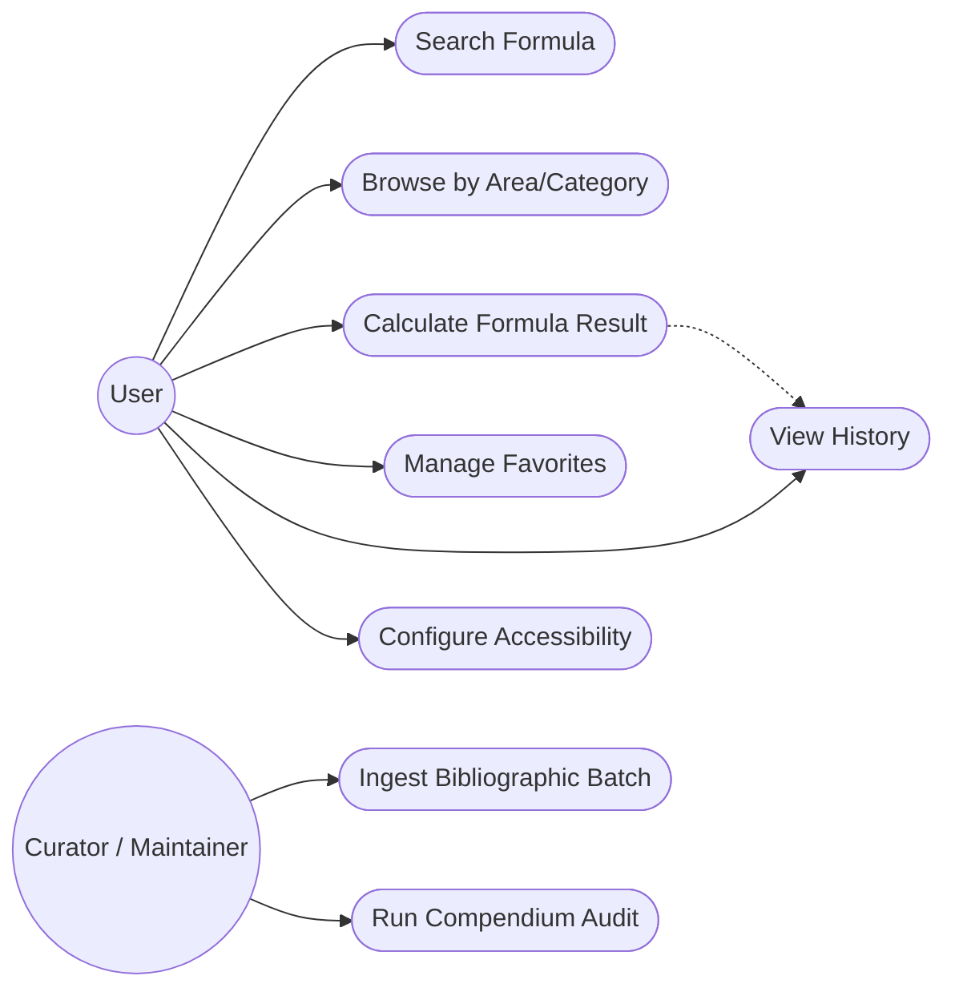
```mermaid
flowchart LR
    User((User))
    Curator((Curator / Maintainer))

    UC1([Search Formula])
    UC2([Browse by Area/Category])
    UC3([Calculate Formula Result])
    UC4([Manage Favorites])
    UC5([View History])
    UC6([Configure Accessibility])
    UC7([Ingest Bibliographic Batch])
    UC8([Run Compendium Audit])

    User --> UC1
    User --> UC2
    User --> UC3
    User --> UC4
    User --> UC5
    User --> UC6
    Curator --> UC7
    Curator --> UC8
    UC3 -.-> UC5
```

### 2.2 Class Diagram

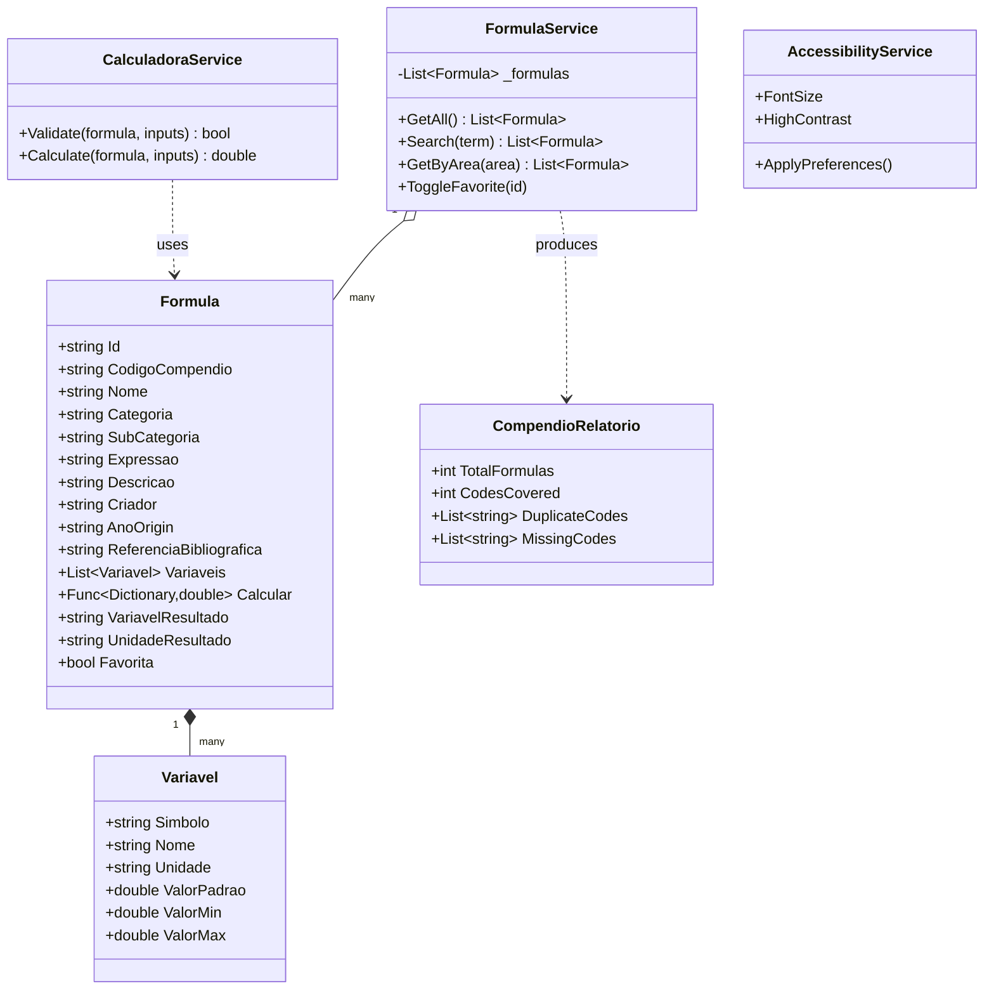
```mermaid
classDiagram
    class Formula {
        +string Id
        +string CodigoCompendio
        +string Nome
        +string Categoria
        +string SubCategoria
        +string Expressao
        +string Descricao
        +string Criador
        +string AnoOrigin
        +string ReferenciaBibliografica
        +List~Variavel~ Variaveis
        +Func~Dictionary,double~ Calcular
        +string VariavelResultado
        +string UnidadeResultado
        +bool Favorita
    }

    class Variavel {
        +string Simbolo
        +string Nome
        +string Unidade
        +double ValorPadrao
        +double ValorMin
        +double ValorMax
    }

    class FormulaService {
        -List~Formula~ _formulas
        +GetAll() List~Formula~
        +Search(term) List~Formula~
        +GetByArea(area) List~Formula~
        +ToggleFavorite(id)
    }

    class CalculadoraService {
        +Validate(formula, inputs) bool
        +Calculate(formula, inputs) double
    }

    class AccessibilityService {
        +FontSize
        +HighContrast
        +ApplyPreferences()
    }

    class CompendioRelatorio {
        +int TotalFormulas
        +int CodesCovered
        +List~string~ DuplicateCodes
        +List~string~ MissingCodes
    }

    FormulaService "1" o-- "many" Formula
    Formula "1" *-- "many" Variavel
    CalculadoraService ..> Formula : uses
    FormulaService ..> CompendioRelatorio : produces
```

### 2.3 Object Diagram

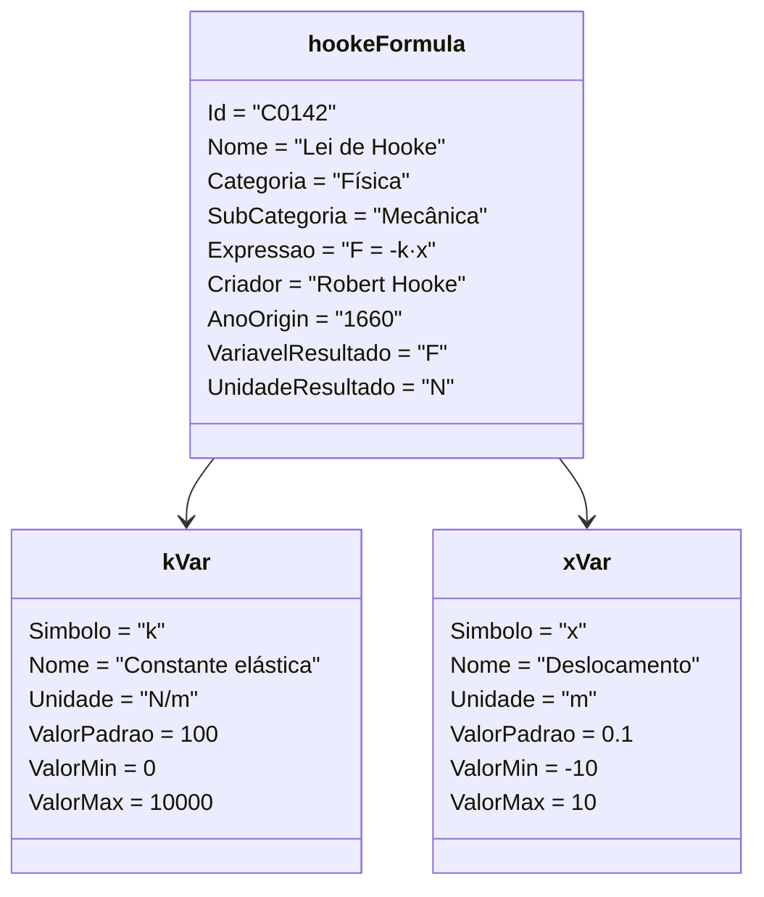
```mermaid
classDiagram
    class hookeFormula {
        Id = "C0142"
        Nome = "Lei de Hooke"
        Categoria = "Física"
        SubCategoria = "Mecânica"
        Expressao = "F = -k·x"
        Criador = "Robert Hooke"
        AnoOrigin = "1660"
        VariavelResultado = "F"
        UnidadeResultado = "N"
    }
    class kVar {
        Simbolo = "k"
        Nome = "Constante elástica"
        Unidade = "N/m"
        ValorPadrao = 100
        ValorMin = 0
        ValorMax = 10000
    }
    class xVar {
        Simbolo = "x"
        Nome = "Deslocamento"
        Unidade = "m"
        ValorPadrao = 0.1
        ValorMin = -10
        ValorMax = 10
    }
    hookeFormula --> kVar
    hookeFormula --> xVar
```

### 2.4 Sequence Diagram — Calculate Formula

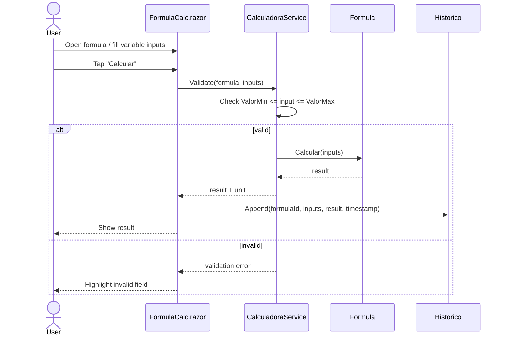
```mermaid
sequenceDiagram
    actor User
    participant Page as FormulaCalc.razor
    participant Calc as CalculadoraService
    participant Model as Formula
    participant Hist as Historico

    User->>Page: Open formula / fill variable inputs
    User->>Page: Tap "Calcular"
    Page->>Calc: Validate(formula, inputs)
    Calc->>Calc: Check ValorMin <= input <= ValorMax
    alt valid
        Calc->>Model: Calcular(inputs)
        Model-->>Calc: result
        Calc-->>Page: result + unit
        Page->>Hist: Append(formulaId, inputs, result, timestamp)
        Page-->>User: Show result
    else invalid
        Calc-->>Page: validation error
        Page-->>User: Highlight invalid field
    end
```

### 2.5 Communication Diagram

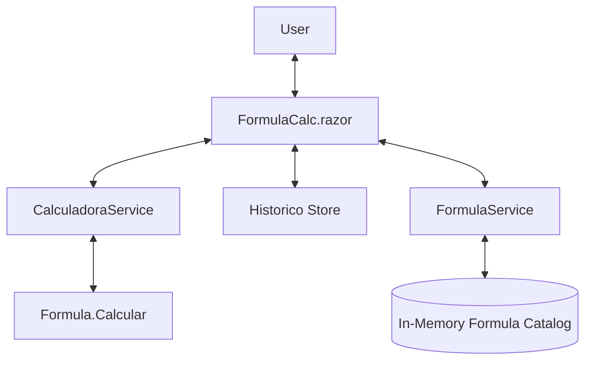
```mermaid
flowchart TB
    U[User] <--> P[FormulaCalc.razor]
    P <--> C[CalculadoraService]
    C <--> M[Formula.Calcular]
    P <--> H[Historico Store]
    P <--> F[FormulaService]
    F <--> D[(In-Memory Formula Catalog)]
```

### 2.6 Activity Diagram — Compendium Audit

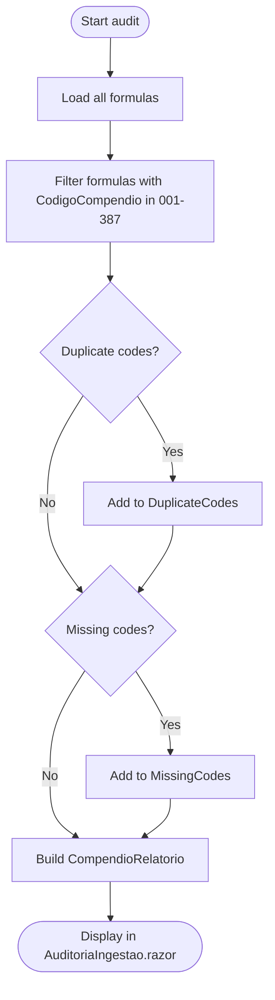
```mermaid
flowchart TD
    Start([Start audit]) --> Load[Load all formulas]
    Load --> Filter[Filter formulas with CodigoCompendio in 001-387]
    Filter --> CheckDup{Duplicate codes?}
    CheckDup -- Yes --> LogDup[Add to DuplicateCodes]
    CheckDup -- No --> CheckMissing
    LogDup --> CheckMissing{Missing codes?}
    CheckMissing -- Yes --> LogMissing[Add to MissingCodes]
    CheckMissing -- No --> BuildReport
    LogMissing --> BuildReport[Build CompendioRelatorio]
    BuildReport --> End([Display in AuditoriaIngestao.razor])
```

### 2.7 State Machine Diagram — Formula Calculation

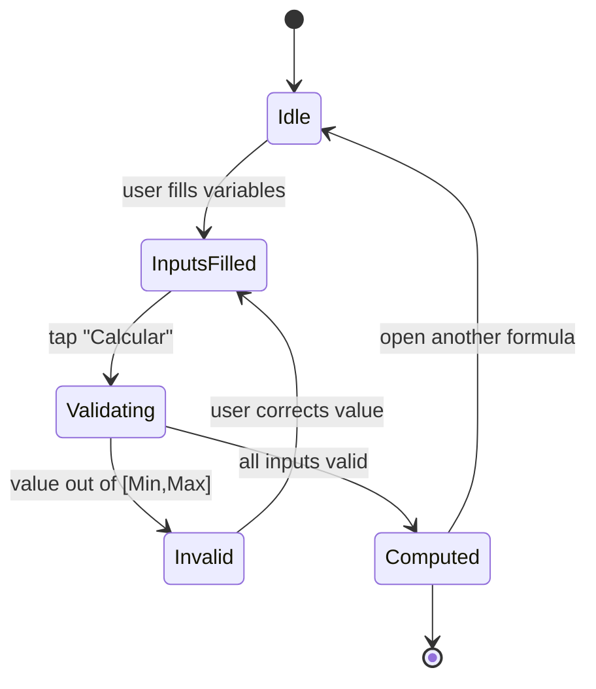
```mermaid
stateDiagram-v2
    [*] --> Idle
    Idle --> InputsFilled: user fills variables
    InputsFilled --> Validating: tap "Calcular"
    Validating --> Invalid: value out of [Min,Max]
    Validating --> Computed: all inputs valid
    Invalid --> InputsFilled: user corrects value
    Computed --> Idle: open another formula
    Computed --> [*]
```

### 2.8 Component Diagram

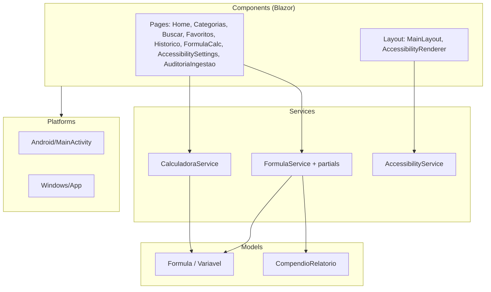
```mermaid
flowchart TB
    subgraph UI["Components (Blazor)"]
        Pages[Pages: Home, Categorias, Buscar, Favoritos, Historico, FormulaCalc, AccessibilitySettings, AuditoriaIngestao]
        Layout[Layout: MainLayout, AccessibilityRenderer]
    end
    subgraph SVC["Services"]
        FS[FormulaService + partials]
        CS[CalculadoraService]
        AS[AccessibilityService]
    end
    subgraph MOD["Models"]
        FM[Formula / Variavel]
        CR[CompendioRelatorio]
    end
    subgraph PLAT["Platforms"]
        AND[Android/MainActivity]
        WIN[Windows/App]
    end

    Pages --> FS
    Pages --> CS
    Layout --> AS
    FS --> FM
    FS --> CR
    CS --> FM
    UI --> PLAT
```

### 2.9 Deployment Diagram

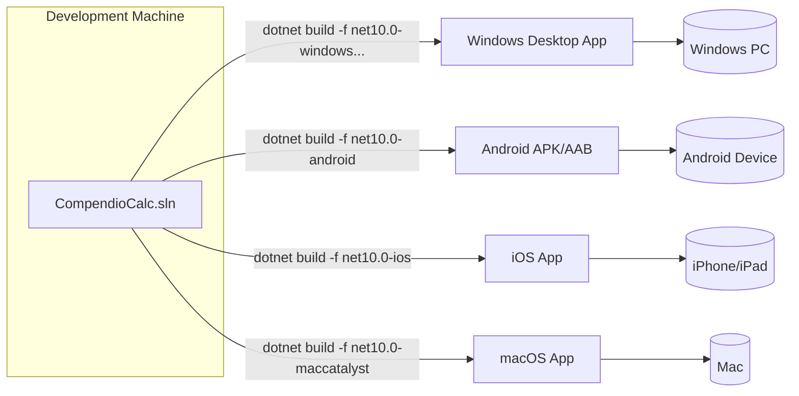
```mermaid
flowchart LR
    subgraph Dev["Development Machine"]
        SRC[CompendioCalc.sln]
    end

    SRC -->|dotnet build -f net10.0-windows...| WinApp[Windows Desktop App]
    SRC -->|dotnet build -f net10.0-android| AndroidApp[Android APK/AAB]
    SRC -->|dotnet build -f net10.0-ios| iOSApp[iOS App]
    SRC -->|dotnet build -f net10.0-maccatalyst| MacApp[macOS App]

    WinApp --> Device1[(Windows PC)]
    AndroidApp --> Device2[(Android Device)]
    iOSApp --> Device3[(iPhone/iPad)]
    MacApp --> Device4[(Mac)]
```

### 2.10 Package Diagram

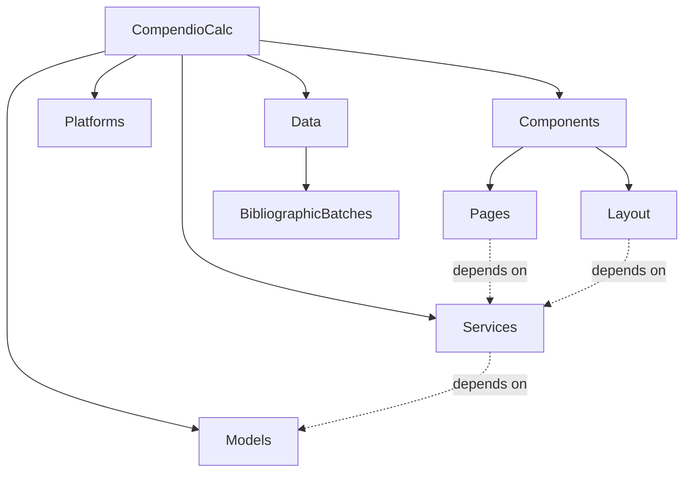
```mermaid
flowchart TB
    Root[CompendioCalc] --> Models
    Root --> Services
    Root --> Components
    Components --> Pages
    Components --> Layout
    Root --> Platforms
    Root --> Data
    Data --> BibliographicBatches
    Services -.depends on.-> Models
    Pages -.depends on.-> Services
    Layout -.depends on.-> Services
```

### 2.11 Composite Structure Diagram — FormulaService

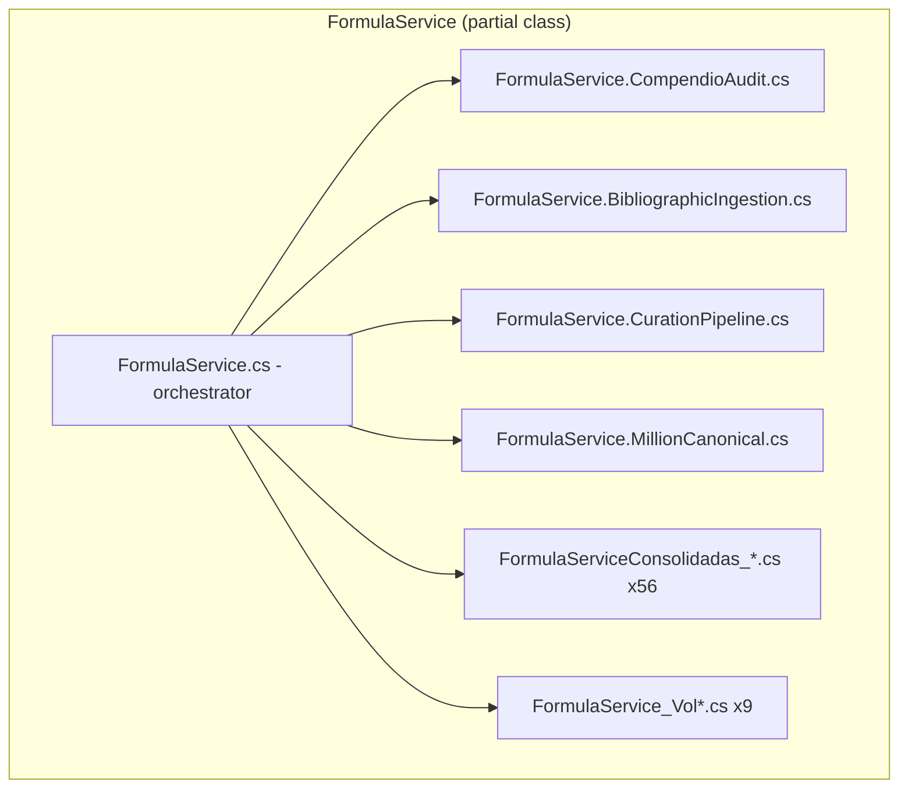
```mermaid
flowchart TB
    subgraph FormulaService["FormulaService (partial class)"]
        Core[FormulaService.cs - orchestrator]
        Audit[FormulaService.CompendioAudit.cs]
        Ingest[FormulaService.BibliographicIngestion.cs]
        Curation[FormulaService.CurationPipeline.cs]
        Canonical[FormulaService.MillionCanonical.cs]
        Areas[FormulaServiceConsolidadas_*.cs x56]
        Volumes[FormulaService_Vol*.cs x9]
    end
    Core --> Audit
    Core --> Ingest
    Core --> Curation
    Core --> Canonical
    Core --> Areas
    Core --> Volumes
```

### 2.12 Interaction Overview Diagram

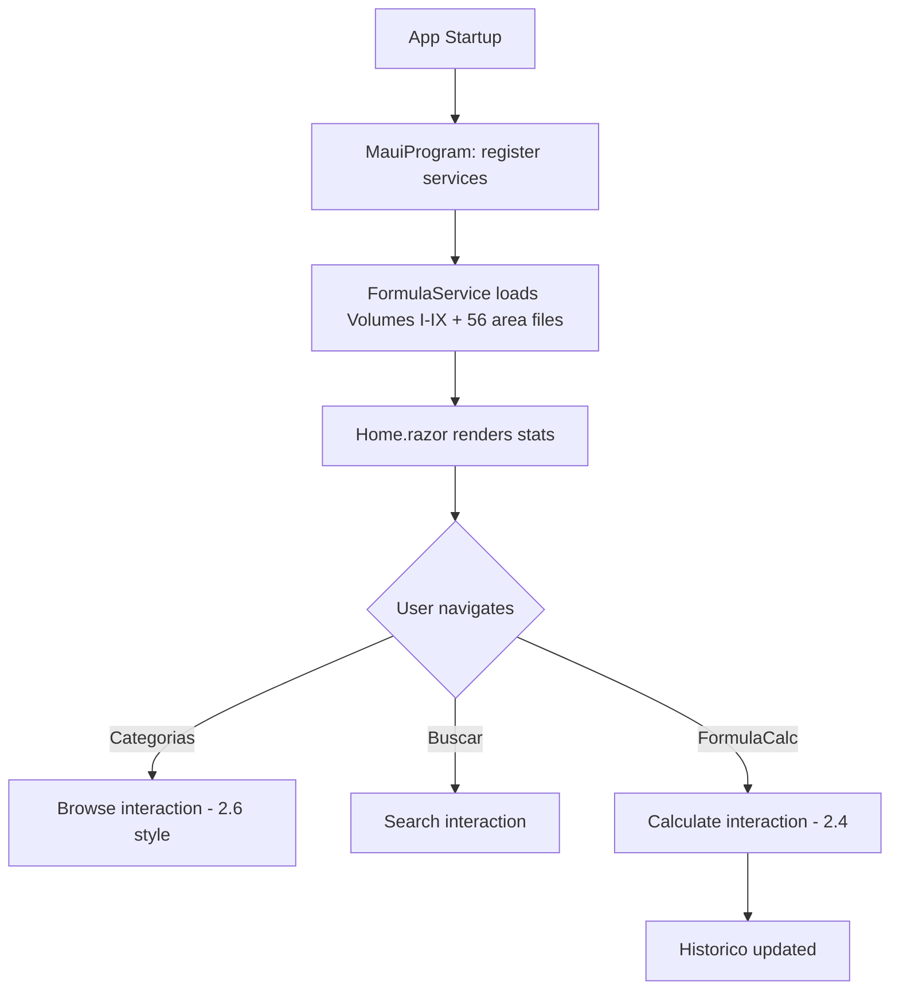
```mermaid
flowchart TD
    A[App Startup] --> B[MauiProgram: register services]
    B --> C[FormulaService loads Volumes I-IX + 56 area files]
    C --> D[Home.razor renders stats]
    D --> E{User navigates}
    E -->|Categorias| F[Browse interaction - 2.6 style]
    E -->|Buscar| G[Search interaction]
    E -->|FormulaCalc| H[Calculate interaction - 2.4]
    H --> I[Historico updated]
```

### 2.13 Timing Diagram — App Startup

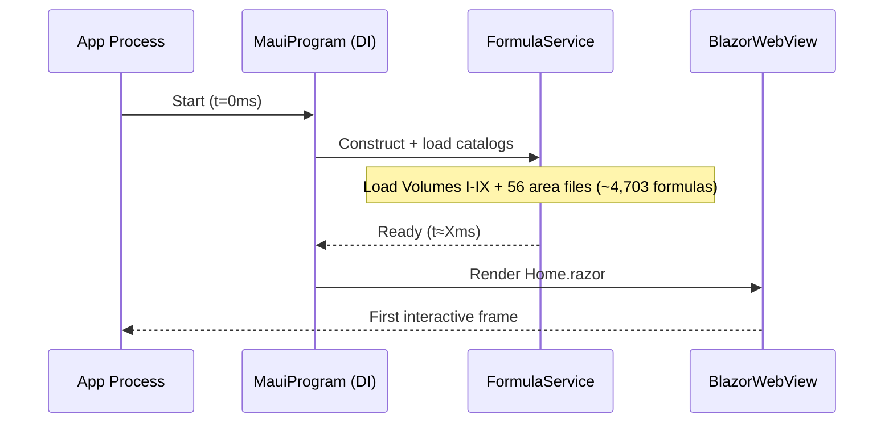
```mermaid
sequenceDiagram
    participant App as App Process
    participant DI as MauiProgram (DI)
    participant FS as FormulaService
    participant UI as BlazorWebView

    App->>DI: Start (t=0ms)
    DI->>FS: Construct + load catalogs
    Note over FS: Load Volumes I-IX + 56 area files (~4,703 formulas)
    FS-->>DI: Ready (t≈Xms)
    DI->>UI: Render Home.razor
    UI-->>App: First interactive frame
```

</details>

---
## 3. Data Modeling

<details>
<summary>▶️ <strong>Click to expand / collapse this section</strong></summary>

### 3.1 Entity-Relationship Diagram (ER)

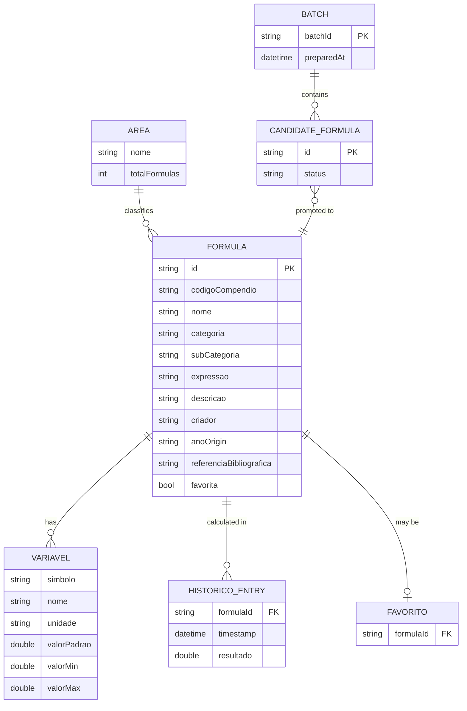
```mermaid
erDiagram
    AREA ||--o{ FORMULA : classifies
    FORMULA ||--o{ VARIAVEL : has
    FORMULA ||--o{ HISTORICO_ENTRY : "calculated in"
    FORMULA ||--o| FAVORITO : "may be"
    BATCH ||--o{ CANDIDATE_FORMULA : contains
    CANDIDATE_FORMULA }o--|| FORMULA : "promoted to"

    AREA {
        string nome
        int totalFormulas
    }
    FORMULA {
        string id PK
        string codigoCompendio
        string nome
        string categoria
        string subCategoria
        string expressao
        string descricao
        string criador
        string anoOrigin
        string referenciaBibliografica
        bool favorita
    }
    VARIAVEL {
        string simbolo
        string nome
        string unidade
        double valorPadrao
        double valorMin
        double valorMax
    }
    HISTORICO_ENTRY {
        string formulaId FK
        datetime timestamp
        double resultado
    }
    FAVORITO {
        string formulaId FK
    }
    BATCH {
        string batchId PK
        datetime preparedAt
    }
    CANDIDATE_FORMULA {
        string id PK
        string status
    }
```

### 3.2 Conceptual Model

> At the conceptual level, the compendium is organized as **Knowledge Area → Category → Subcategory → Formula → Variables**, with cross-cutting concerns of **Favorites** and **History** attached to individual formulas, and a separate **Curation** stream (Batch → Candidate Formula → promoted Formula).

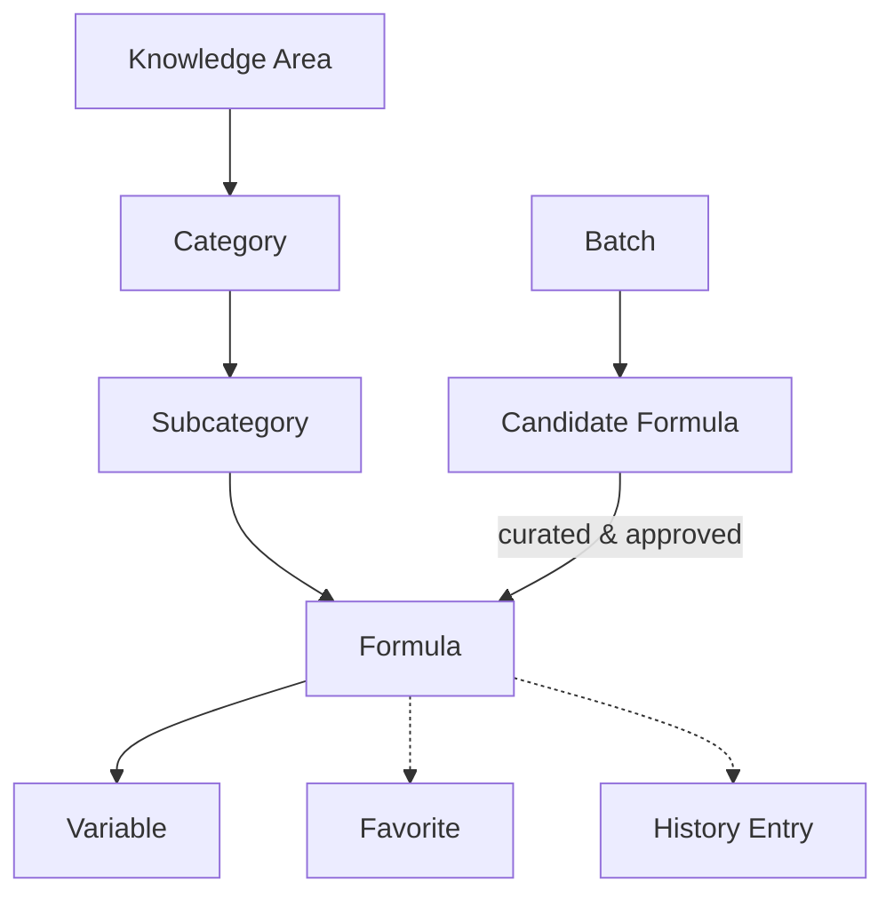
```mermaid
flowchart TB
    Area[Knowledge Area] --> Category --> Subcategory --> Formula
    Formula --> Variable
    Formula -.-> Favorite
    Formula -.-> HistoryEntry[History Entry]
    Batch --> Candidate[Candidate Formula] -->|curated & approved| Formula
```

### 3.3 Logical Model

> The logical model maps directly onto the C# classes in `Models/Formula.cs` and `Models/CompendioRelatorio.cs` — see the [`Formula`/`Variavel` class diagram](#2-uml-diagrams). `CompendioRelatorio` is the logical aggregate produced by the audit process (§2.6), holding totals, covered/missing/duplicate codes per area.

### 3.4 Physical Model

> Today, all formula data is **embedded in-memory** as C# object initializers across `FormulaService_Vol*.cs` (Volumes I–IX) and `FormulaServiceConsolidadas_[Area].cs` (56 area files) — there is no external database. The physical "storage" is the compiled assembly itself. Bibliographic batches (`Data/BibliographicBatches/*.jsonl`) are the only on-disk, file-based physical store, used during curation.

### 3.5 Data Dictionary

| Field | Type | Description |
|-------|------|-------------|
| `Formula.Id` | string | Unique formula identifier (e.g., `C2501`, `mec001`, `qc_11`). |
| `Formula.CodigoCompendio` | string | Official compendium code, `001`–`387` for core formulas. |
| `Formula.Nome` | string | Human-readable formula name. |
| `Formula.Categoria` / `SubCategoria` | string | Classification within a knowledge area. |
| `Formula.Expressao` | string | Symbolic/LaTeX-style expression. |
| `Formula.Descricao` | string | Description, historical context, applications. |
| `Formula.Criador` / `AnoOrigin` | string | Creator/discoverer and year of origin. |
| `Formula.ReferenciaBibliografica` | string | Source/reference citation. |
| `Formula.Variaveis` | List\<Variavel\> | Input variables. |
| `Formula.Calcular` | Func\<Dictionary\<string,double\>,double\> | Executable calculation. |
| `Formula.VariavelResultado` / `UnidadeResultado` | string | Result name and unit. |
| `Formula.Favorita` | bool | Whether the formula is favorited. |
| `Variavel.Simbolo` / `Nome` / `Unidade` | string | Symbol, name, unit of a variable. |
| `Variavel.ValorPadrao` / `ValorMin` / `ValorMax` | double | Default and valid range. |
| `CompendioRelatorio.TotalFormulas` | int | Total formulas audited. |
| `CompendioRelatorio.CodesCovered` | int | Number of official codes (001–387) present. |
| `CompendioRelatorio.DuplicateCodes` / `MissingCodes` | List\<string\> | Audit findings. |

### 3.6 Data Flow Diagram (DFD)

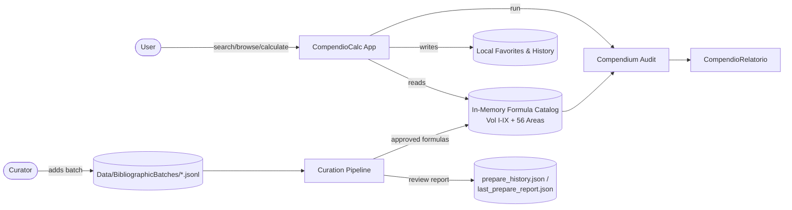
```mermaid
flowchart LR
    User([User]) -->|search/browse/calculate| App[CompendioCalc App]
    App -->|reads| Catalog[(In-Memory Formula Catalog\nVol I-IX + 56 Areas)]
    App -->|writes| LocalState[(Local Favorites & History)]
    Curator([Curator]) -->|adds batch| Batches[(Data/BibliographicBatches/*.jsonl)]
    Batches --> Pipeline[Curation Pipeline]
    Pipeline -->|review report| Reports[(prepare_history.json /\nlast_prepare_report.json)]
    Pipeline -->|approved formulas| Catalog
    App -->|run| Audit[Compendium Audit]
    Catalog --> Audit
    Audit --> AuditReport[CompendioRelatorio]
```

### 3.7 Data Lineage

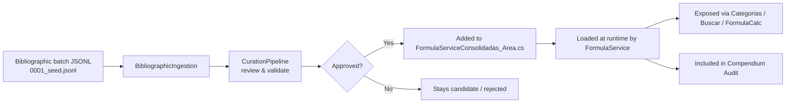
```mermaid
flowchart LR
    A[Bibliographic batch JSONL\n0001_seed.jsonl] --> B[BibliographicIngestion]
    B --> C[CurationPipeline\nreview & validate]
    C --> D{Approved?}
    D -- Yes --> E[Added to FormulaServiceConsolidadas_Area.cs]
    D -- No --> F[Stays candidate / rejected]
    E --> G[Loaded at runtime by FormulaService]
    G --> H[Exposed via Categorias / Buscar / FormulaCalc]
    G --> I[Included in Compendium Audit]
```

</details>

---

## 4. Architecture

<details>
<summary>▶️ <strong>Click to expand / collapse this section</strong></summary>

### 4.1 Architecture Diagram

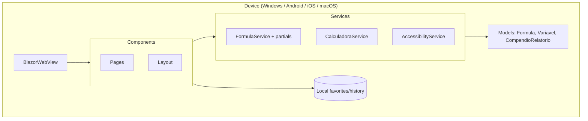
```mermaid
flowchart TB
    subgraph Client["Device (Windows / Android / iOS / macOS)"]
        BWV[BlazorWebView]
        subgraph Components
            Pages
            Layout
        end
        subgraph Services
            FS[FormulaService + partials]
            CS[CalculadoraService]
            AS[AccessibilityService]
        end
        Models[Models: Formula, Variavel, CompendioRelatorio]
        LocalStore[(Local favorites/history)]
    end

    BWV --> Components
    Components --> Services
    Services --> Models
    Components --> LocalStore
```

### 4.2 C4 Model

#### 4.2.1 Context

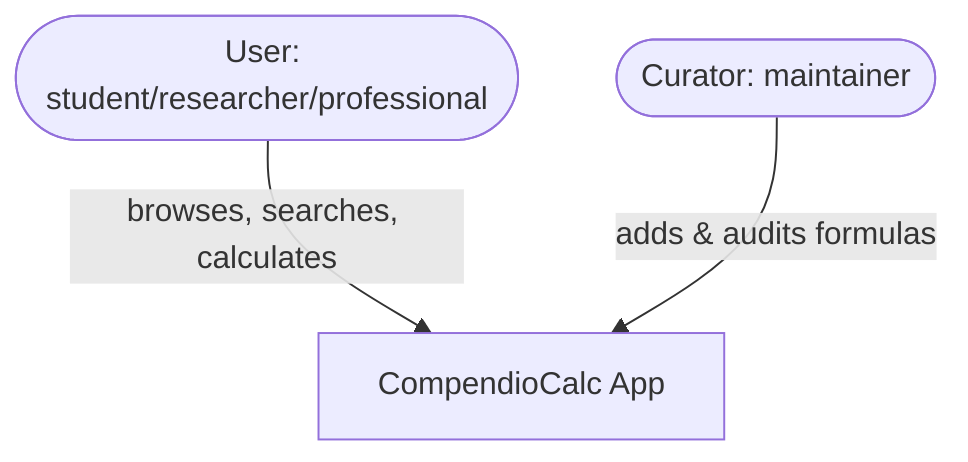
```mermaid
flowchart TB
    User([User: student/researcher/professional])
    Curator([Curator: maintainer])
    System[CompendioCalc App]

    User -->|browses, searches, calculates| System
    Curator -->|adds & audits formulas| System
```

#### 4.2.2 Containers

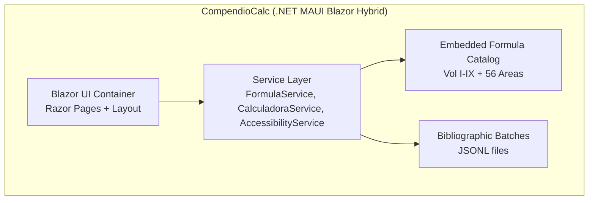
```mermaid
flowchart TB
    subgraph App["CompendioCalc (.NET MAUI Blazor Hybrid)"]
        UIContainer[Blazor UI Container\nRazor Pages + Layout]
        SvcContainer[Service Layer\nFormulaService, CalculadoraService, AccessibilityService]
        DataContainer[Embedded Formula Catalog\nVol I-IX + 56 Areas]
        BatchContainer[Bibliographic Batches\nJSONL files]
    end
    UIContainer --> SvcContainer --> DataContainer
    SvcContainer --> BatchContainer
```

#### 4.2.3 Components

```mermaid
flowchart TB
    subgraph SvcContainer["Service Layer"]
        FS[FormulaService - orchestrator]
        Audit[CompendioAudit]
        Ingest[BibliographicIngestion]
        Curation[CurationPipeline]
        Calc[CalculadoraService]
        Access[AccessibilityService]
    end
    FS --> Audit
    FS --> Ingest --> Curation
    FS --> Calc
```

#### 4.2.4 Code (excerpt)

```mermaid
classDiagram
    class CalculadoraService {
        +Validate(Formula, Dictionary) bool
        +Calculate(Formula, Dictionary) double
    }
    class Formula {
        +Calcular Func
    }
    CalculadoraService ..> Formula
```

### 4.3 Layered Architecture

```mermaid
flowchart TB
    L1["Presentation Layer\n(Razor Pages, Layout, CSS theme)"] --> L2
    L2["Application/Service Layer\n(FormulaService, CalculadoraService, AccessibilityService)"] --> L3
    L3["Domain/Model Layer\n(Formula, Variavel, CompendioRelatorio)"] --> L4
    L4["Data Layer\n(Embedded catalogs + Bibliographic Batches JSONL)"]
```

### 4.4 Modularity (in lieu of Microservices)

> CompendioCalc is a **modular monolith**, not a microservices system — appropriate for a single-developer, client-only app. Modularity is achieved at the **service-file level**: each of the 56 knowledge areas lives in its own `FormulaServiceConsolidadas_[Area].cs` partial class, and cross-cutting concerns (audit, ingestion, curation) are separate partial classes of `FormulaService`. This keeps the "many small modules, one process" benefit of microservices without the deployment/network complexity.

```mermaid
flowchart LR
    Core[FormulaService core] --- A1[Area: Física]
    Core --- A2[Area: Química]
    Core --- A3[Area: ... 53 more areas]
    Core --- Audit[CompendioAudit]
    Core --- Ingest[BibliographicIngestion]
```

### 4.5 Infrastructure / Network

> CompendioCalc is a **fully client-side application** with no network dependency for its core features — there is no server, API, or database to provision. The only "infrastructure" is the build/distribution pipeline (developer machine → platform-specific packages).

```mermaid
flowchart LR
    Dev[Developer Machine\n.NET 10 SDK + MAUI workload] -->|dotnet publish| Artifacts
    Artifacts --> WinPkg[Windows MSIX/EXE]
    Artifacts --> AndroidPkg[Android APK/AAB]
    Artifacts --> iOSPkg[iOS IPA]
    Artifacts --> MacPkg[macOS App]
```

### 4.6 Cloud / Store Deployment

```mermaid
flowchart LR
    Build[CI Build] --> Sign[Code Signing]
    Sign --> Stores
    subgraph Stores
        MS[Microsoft Store / Direct EXE]
        Play[Google Play]
        AppStore[Apple App Store]
    end
```

### 4.7 Architecture Decision Records (ADR)

| ID | Decision | Rationale |
|----|----------|-----------|
| ADR-001 | Use .NET MAUI Blazor Hybrid instead of separate native apps | Single C# codebase + Razor UI shared across Windows, Android, iOS, macOS — critical for a single-developer project targeting 10,000+ formulas. |
| ADR-002 | Store formula catalog in-memory as C# object initializers, not in a database | Avoids runtime DB dependency, keeps the app fully offline, and lets each area be a self-contained, reviewable C# file. |
| ADR-003 | Split `FormulaService` into partial classes per concern (audit, ingestion, curation, areas) | Keeps each file manageable in size despite the catalog having 4,700+ entries. |
| ADR-004 | Use JSONL for bibliographic batches | Append-friendly, line-delimited format suited for incremental curation batches. |

### 4.8 System Integration

> CompendioCalc does not integrate with external systems at runtime. The only "integration points" are the **offline Python scripts** (`analyze_report.py`, `audit_parser_safe.py`) used by the maintainer to analyze audit/curation JSON reports outside the app.

```mermaid
flowchart LR
    App[CompendioCalc] -->|exports| Reports[(last_prepare_report.json\nprepare_history.json)]
    Reports --> Py[analyze_report.py / audit_parser_safe.py]
    Py --> Insights[Curation insights for maintainer]
```

### 4.9 Event Flow

```mermaid
flowchart TD
    E1[AppStarted] --> E2[CatalogLoaded]
    E2 --> E3[UserNavigated]
    E3 --> E4[FormulaSelected]
    E4 --> E5[CalculationRequested]
    E5 --> E6{ValidationResult}
    E6 -->|Valid| E7[CalculationCompleted]
    E6 -->|Invalid| E8[ValidationFailed]
    E7 --> E9[HistoryEntryAdded]
    E4 --> E10[FavoriteToggled]
```

### 4.10 CI/CD Pipeline

```mermaid
flowchart LR
    Dev[Push to main] --> Restore[dotnet restore]
    Restore --> Build["dotnet build (multi-target)"]
    Build --> Test[Run unit tests - CalculadoraService, Audit]
    Test --> Package["dotnet publish per platform"]
    Package --> Artifacts[(Windows/Android/iOS/macOS artifacts)]
```

</details>

---

## 5. Business Processes

<details>
<summary>▶️ <strong>Click to expand / collapse this section</strong></summary>

### 5.1 BPMN — Add a New Formula to the Compendium

```mermaid
flowchart LR
    Start((Start)) --> Draft[Curator drafts Formula entry]
    Draft --> Batch[Add to bibliographic batch JSONL]
    Batch --> Ingest[Run BibliographicIngestion]
    Ingest --> Curation[CurationPipeline review]
    Curation --> Decision{Meets RN01-RN03?}
    Decision -- No --> Reject[Mark as rejected/candidate]
    Decision -- Yes --> Merge[Merge into FormulaServiceConsolidadas_Area.cs]
    Merge --> Register[Register area in catalog loader]
    Register --> Audit[Run Compendium Audit]
    Audit --> End((End))
    Reject --> End
```

### 5.2 Flowchart — User Calculates a Formula

```mermaid
flowchart TD
    A([User opens app]) --> B[Browse Categorias or use Buscar]
    B --> C[Select a Formula]
    C --> D[Open FormulaCalc - Calcular tab]
    D --> E[Fill variable inputs]
    E --> F{Inputs within bounds?}
    F -- No --> E
    F -- Yes --> G[Run Calcular lambda]
    G --> H[Show result + unit]
    H --> I[Append to Historico]
    I --> J([End])
```

### 5.3 As-Is Map

```mermaid
flowchart LR
    A[4,703+ formulas across 56 areas] --> B[Manual area-by-area authoring]
    B --> C[Manual bibliographic batch curation]
    C --> D[Periodic compendium audit 001-387]
```

### 5.4 To-Be Map

```mermaid
flowchart LR
    A[10,000+ formulas target] --> B[Streamlined curation pipeline\nwith automated validation]
    B --> C[Continuous compendium audit in CI]
    C --> D[Community contributions via PR per area]
```

### 5.5 SIPOC

| Suppliers | Inputs | Process | Outputs | Customers |
|-----------|--------|---------|---------|-----------|
| Curators, bibliographic sources | Candidate formulas (JSONL), references | Curation Pipeline → Merge → Audit | Validated `Formula` entries in catalog | App users (students, researchers, professionals) |

</details>

---

## 6. UX/UI & Prototypes

<details>
<summary>▶️ <strong>Click to expand / collapse this section</strong></summary>

### 6.1 Persona

> **"Ana, the Engineering Student"** — 21 years old, studies Civil Engineering, needs to quickly look up and compute formulas (Euler buckling, Mohr-Coulomb) during exercises and exams, often offline on a budget Android phone. Values speed, clarity of units, and trustworthy sourcing (creator/year/reference).

### 6.2 User Journey

```mermaid
journey
    title Ana looks up and calculates a formula
    section Discover
      Open app: 5: Ana
      See Home stats: 4: Ana
    section Find
      Browse Categorias > Engenharia Civil: 4: Ana
      Or use Buscar "Euler": 5: Ana
    section Use
      Open FormulaCalc detail: 5: Ana
      Read "Sobre" tab for context: 4: Ana
      Fill variables in "Calcular" tab: 4: Ana
      Get result with unit: 5: Ana
    section Retain
      Mark as favorite: 5: Ana
      Revisit via Historico later: 4: Ana
```

### 6.3 Wireframe — Formula Detail Screen

```mermaid
flowchart TB
    subgraph Screen["FormulaCalc.razor"]
        Breadcrumb["Categorias > Engenharia Civil"]
        Title["Formula Name · Criador · Ano"]
        Expr["Expression box"]
        Tabs["[ Calcular | Sobre | Variáveis ]"]
        Inputs["Variable input fields (symbol, name, unit)"]
        Result["Result + unit"]
    end
    Breadcrumb --> Title --> Expr --> Tabs --> Inputs --> Result
```

### 6.4 Mockup Description

> Dark theme (`--bg-card`, `--text-primary`, `--border`), card-based layout, top breadcrumb, large formula title with author/year subtitle, a highlighted expression box, a 3-tab switcher, and a star icon (★/☆) in the header for favoriting — consistent across `Home`, `Categorias`, `Buscar`, `Favoritos`, `Historico`, and `FormulaCalc`.

### 6.5 Navigable Prototype (Screen Map)

```mermaid
flowchart LR
    Home -->|browse| Categorias
    Home -->|search| Buscar
    Categorias --> FormulaCalc
    Buscar --> FormulaCalc
    FormulaCalc -->|★| Favoritos
    FormulaCalc -->|calculate| Historico
    Home --> AccessibilitySettings
    Home --> AuditoriaIngestao
```

### 6.6 Screen Flow

```mermaid
stateDiagram-v2
    [*] --> Home
    Home --> Categorias
    Home --> Buscar
    Home --> Favoritos
    Home --> Historico
    Home --> AccessibilitySettings
    Home --> AuditoriaIngestao
    Categorias --> FormulaCalc
    Buscar --> FormulaCalc
    Favoritos --> FormulaCalc
    FormulaCalc --> Home
```

### 6.7 Design System

| Token | Purpose |
|-------|---------|
| `--bg-card` | Card/surface background (dark theme). |
| `--text-primary` | Primary text color. |
| `--text-secondary` | Secondary text (subtitles, breadcrumbs). |
| `--text-muted` | Muted/help text (e.g., variable descriptions). |
| `--border` | Border color for cards, tabs, inputs. |
| Tabs (`.info-tab`, `.info-tab.active`) | Tab navigation within `FormulaCalc`. |
| Favorite button (`.formula-fav-btn.active`) | ★/☆ toggle styling. |

### 6.8 Card Sorting

> The 56 knowledge areas were grouped (card-sorting style) into broader clusters for navigation in `Categorias.razor`: **Exact Sciences** (Physics, Chemistry, Mathematics, Statistics, Astronomy/Astrophysics), **Life & Health Sciences** (Biology, Medicine, Pharmacy, Nutrition, Veterinary, Neuroscience, Public Health), **Engineering** (Civil, Electrical, Mechanical, Chemical, Biomedical, Environmental, Materials, Computer, Petroleum, Production), **Computing & AI** (Computer Science, Quantum Computing, Data Science, AI, Robotics, Computer Vision, InfoSec), **Social Sciences, Arts & Humanities** (Economics, Law, Sociology, Psychology, Philosophy, Arts, Music, Education, Communication, Administration), **Earth & Environment** (Geography, Geophysics, Oceanography, Environmental Science, Sustainability, Paleontology).

### 6.9 Empathy Map

| Quadrant | Notes (Persona: Ana) |
|----------|----------------------|
| **Says** | "I just need the formula and units, fast." |
| **Thinks** | "Is this the right version of the equation? Who derived it?" |
| **Does** | Searches by keyword, checks "Sobre" tab for context, calculates, favorites for the exam week. |
| **Feels** | Reassured when creator/year/reference are shown; frustrated by ambiguous units. |

### 6.10 Roadmap

```mermaid
gantt
    title CompendioCalc Roadmap (toward 10,000+ formulas)
    dateFormat YYYY-MM-DD
    section Catalog Growth
    Reach 5,000 formulas        :done, c1, 2025-01-01, 2025-06-30
    Reach 7,500 formulas        :active, c2, 2025-07-01, 2026-03-31
    Reach 10,000 formulas       :c3, 2026-04-01, 2026-12-31
    section Platform
    iOS/macOS polish            :p1, 2025-09-01, 2026-02-28
    section Quality
    Full compendium audit pass  :a1, 2025-10-01, 2026-01-31
```

</details>

---

## 7. Technical Documentation

<details>
<summary>▶️ <strong>Click to expand / collapse this section</strong></summary>

### 7.1 Internal Service "API" (OpenAPI-style description)

> CompendioCalc has no HTTP API — the "API" is the internal C# service contract consumed by Razor components. Documented here in an OpenAPI-like shape for consistency:

```yaml
FormulaService:
  GetAll: () -> List<Formula>
  Search: (term: string) -> List<Formula>
  GetByArea: (area: string) -> List<Formula>
  GetById: (id: string) -> Formula?
  ToggleFavorite: (id: string) -> void
  GetFavorites: () -> List<Formula>

CalculadoraService:
  Validate: (formula: Formula, inputs: Dictionary<string,double>) -> bool
  Calculate: (formula: Formula, inputs: Dictionary<string,double>) -> double

AccessibilityService:
  GetPreferences: () -> AccessibilityPreferences
  SetFontSize: (size: int) -> void
  SetHighContrast: (enabled: bool) -> void
```

### 7.2 User Manual (excerpt)

1. Open the app — the **Home** screen shows total formulas and areas.
2. To browse, tap **Categorias**, pick a knowledge area, then a category/subcategory.
3. To search, tap **Buscar** and type any part of a formula's name, creator, or code.
4. Tap a formula to open its detail page. Use the **Sobre** tab to read its history and reference, **Variáveis** to see all inputs/outputs, and **Calcular** to compute a result.
5. Tap ☆ to favorite a formula; view favorites under **Favoritos**.
6. Past calculations appear under **Historico**.
7. Adjust font size/contrast under **Accessibility Settings**.

### 7.3 Technical Manual (excerpt)

> See [Repository Structure](#-repository-structure) and [Implementation Highlights](#-implementation-highlights). Key points for developers: (1) all formulas are plain C# object initializers — no reflection/codegen; (2) `FormulaService` is registered as a singleton in `MauiProgram.cs` so the catalog loads once; (3) `CalculadoraService` is stateless and pure with respect to a given `Formula`/inputs pair; (4) `AccessibilityRenderer.razor` wraps `@Body` in `MainLayout.razor` to apply CSS variable overrides.

### 7.4 Changelog (excerpt)

| Version | Highlights |
|---------|------------|
| 0.1.0 | Initial MAUI Blazor Hybrid scaffold, `Formula`/`Variavel` model, Volumes I–IV. |
| 0.2.0 | Added Volumes V–IX, reaching ~2,500 formulas. |
| 0.3.0 | Added 56 `FormulaServiceConsolidadas_[Area]` files, Favorites, History. |
| 0.4.0 | Added Accessibility settings, Compendium Audit (codes 001–387), Bibliographic Ingestion pipeline. |
| 0.5.0 (current) | Reached 4,703+ formulas across 56 areas; ongoing curation toward 10,000+. |

### 7.5 Installation / Deployment Guide

> See [How to Run](#-how-to-run) for development. For distribution: `dotnet publish -f <target> -c Release` per platform, then sign and package (MSIX for Windows, AAB for Android via Google Play, IPA for iOS/macOS via Xcode/Apple Developer Program).

### 7.6 Runbook

| Scenario | Action |
|----------|--------|
| App fails to start on Android | Check `Platforms/Android/MainActivity.cs` and ensure the MAUI workload matches the installed Android SDK/NDK versions. |
| A formula's `Calcular` throws | Locate the formula by `Id` in its `FormulaServiceConsolidadas_[Area].cs`/`FormulaService_Vol*.cs` file, verify the lambda against `Variaveis` bounds, fix and rebuild. |
| Compendium audit reports duplicate codes | Search all area/volume files for the reported `CodigoCompendio`, keep one entry, reassign or remove the duplicate. |
| Curation pipeline rejects a batch entry | Check `last_prepare_report.json` for the rejection reason (missing field, invalid bounds) and fix the JSONL entry in `Data/BibliographicBatches/`. |

### 7.7 Coding Standards

- One area per `FormulaServiceConsolidadas_[Area].cs` file; method name `AdicionarFormulasConsolidadas_[Area]()`.
- Every `Formula` must set `Descricao`, `Criador`, `AnoOrigin`, `ReferenciaBibliografica`, ≥1 `Variavel`, and a working `Calcular`.
- Razor pages follow the dark-theme CSS variable tokens (§6.7) — no hardcoded colors.
- New services are registered in `MauiProgram.cs` via DI, never instantiated directly in pages.

### 7.8 Data/"Database" Documentation

> No relational database is used. The authoritative "schema" is the `Formula`/`Variavel`/`CompendioRelatorio` C# classes (§3.5 Data Dictionary) and the JSONL schema for bibliographic batches — each line in `0001_seed.jsonl` is a candidate `Formula`-shaped JSON object awaiting curation.

</details>

---

## 8. Project Management

<details>
<summary>▶️ <strong>Click to expand / collapse this section</strong></summary>

### 8.1 Project Charter

| Field | Value |
|-------|-------|
| **Project Name** | CompendioCalc |
| **Sponsor / Owner** | Victor H. J. Santiago |
| **Objective** | Build a cross-platform compendium of 10,000+ scientific/technical formulas with built-in calculators. |
| **Scope** | .NET MAUI Blazor Hybrid app for Windows/Android/iOS/macOS; no backend. |
| **Success Criteria** | 10,000+ curated, audited formulas; app runs on all 4 target platforms. |

### 8.2 Scope Statement

> **In scope:** formula catalog (56 areas, 9 volumes), calculator, favorites, history, accessibility, bibliographic ingestion/curation, compendium audit, multi-platform builds. **Out of scope:** user accounts, cloud sync, social/sharing features, monetization.

### 8.3 Work Breakdown Structure (WBS)

```mermaid
flowchart TB
    P[CompendioCalc] --> A[Catalog Content]
    P --> B[App Shell & UI]
    P --> C[Calculation Engine]
    P --> D[Personalization]
    P --> E[Accessibility]
    P --> F[Curation Pipeline]
    A --> A1[Volumes I-IX]
    A --> A2[56 Area files]
    B --> B1[Pages/Layout]
    B --> B2[Design System]
    C --> C1[CalculadoraService]
    D --> D1[Favorites]
    D --> D2[History]
    F --> F1[Bibliographic Ingestion]
    F --> F2[Compendium Audit]
```

### 8.4 Schedule (Gantt)

```mermaid
gantt
    title CompendioCalc - High-Level Schedule
    dateFormat YYYY-MM-DD
    section Foundation
    App shell + models      :done, t1, 2024-09-01, 2024-11-30
    Volumes I-IV             :done, t2, 2024-10-01, 2025-02-28
    section Expansion
    Volumes V-IX + 56 areas  :done, t3, 2025-01-01, 2025-06-30
    Favorites/History/A11y   :done, t4, 2025-04-01, 2025-07-31
    Curation pipeline        :active, t5, 2025-06-01, 2025-12-31
    section Toward 10k
    Audit & gap-fill         :t6, 2025-10-01, 2026-06-30
    10,000 formulas          :t7, 2026-01-01, 2026-12-31
```

### 8.5 Risk Management Plan

> Risks are tracked informally (single-maintainer project) but follow identify → assess → mitigate → monitor, focused on **content correctness** (formula errors) and **scope creep** (10,000-formula goal).

### 8.6 Risk Matrix

| Risk | Probability | Impact | Mitigation |
|------|-------------|--------|------------|
| Incorrect `Calcular` lambda produces wrong results | Medium | High | Unit tests per area + Compendium Audit. |
| Duplicate/missing `CodigoCompendio` (001–387) | Medium | Medium | Automated audit (`CompendioAudit`) run regularly. |
| Catalog growth slows due to manual authoring | High | Medium | Bibliographic ingestion + curation pipeline to streamline new entries. |
| Platform-specific build breakage (iOS/macOS) | Medium | Medium | CI builds across all 4 targets before release. |

### 8.7 Communication Plan

| Channel | Purpose | Audience |
|---------|---------|----------|
| GitHub Issues/PRs | Formula contributions, bug reports | Contributors |
| `CHANGELOG` (§7.4) | Release notes | Users/contributors |
| `last_prepare_report.json` | Curation run results | Maintainer |

### 8.8 RACI Matrix

| Activity | Maintainer (Victor) | Contributor | User |
|----------|:---:|:---:|:---:|
| Add formulas to an area file | R/A | R | – |
| Review/curate bibliographic batch | A | R | – |
| Run Compendium Audit | R/A | C | – |
| Report incorrect formula | I | C | R |
| Use calculator/favorites/history | I | I | R/A |

### 8.9 SWOT Analysis

| Strengths | Weaknesses |
|-----------|------------|
| Huge breadth (56 areas, 4,700+ formulas); single codebase for 4 platforms; rich metadata (history, references) | Single-maintainer bottleneck; manual curation; no automated formula-correctness proofs |
| **Opportunities** | **Threats** |
| Community contributions per area file; educational market | Scope (10,000 formulas) may slow without more contributors; formula errors damage trust |

### 8.10 Business Case

> Existing formula references are scattered across textbooks, PDFs, and single-domain apps. CompendioCalc consolidates a broad, calculation-ready, offline-first compendium into one cross-platform app, valuable to students and professionals across dozens of fields — a differentiator versus narrow single-subject calculator apps.

### 8.11 ROI / Viability

> As a free, open-source (MIT) project, "ROI" is measured in **adoption, contributions, and educational impact** rather than revenue: number of areas/formulas, GitHub stars/forks, and community-submitted formula batches.

### 8.12 Change Management Plan

> Changes to the formula schema (`Formula`/`Variavel`) are high-impact (affect 4,700+ entries) and require: (1) ADR documenting the change, (2) a migration script/find-replace across all area/volume files, (3) re-run of Compendium Audit, (4) version bump in [Changelog](#7-technical-documentation).

### 8.13 Contingency Plan

| Scenario | Contingency |
|----------|-------------|
| A new .NET/MAUI version breaks a platform target | Pin to last known-good SDK version in `global.json` until fixed. |
| Catalog growth stalls | Prioritize curation pipeline automation over manual area authoring. |

### 8.14 Lessons Learned

> Splitting `FormulaService` into per-area partial classes (instead of one massive file) was essential for maintainability at 4,700+ formulas. A dedicated curation pipeline + audit (rather than ad-hoc edits) became necessary once the catalog passed ~1,000 entries.

</details>

---

## 9. Business Analysis

<details>
<summary>▶️ <strong>Click to expand / collapse this section</strong></summary>

### 9.1 Business Model Canvas

| Block | Content |
|-------|---------|
| **Key Partners** | Open-source contributors, academic/bibliographic sources |
| **Key Activities** | Formula authoring, curation, auditing, multi-platform builds |
| **Value Proposition** | Largest cross-platform, offline, calculation-ready formula compendium (10,000+ goal) |
| **Customer Relationships** | Open-source community (issues/PRs) |
| **Customer Segments** | Students, researchers, engineers, professionals across 56 fields |
| **Key Resources** | C# formula catalog, MAUI codebase, maintainer expertise |
| **Channels** | GitHub repository, app store distributions |
| **Cost Structure** | Maintainer time, platform developer accounts (Apple/Google) |
| **Revenue Streams** | None (free/open-source, MIT license) |

### 9.2 Stakeholder Analysis

| Stakeholder | Interest | Influence |
|-------------|----------|-----------|
| Maintainer (Victor H. J. Santiago) | Project direction, quality | High |
| Contributors | Add formulas/areas | Medium |
| End users (students/professionals) | Accurate, fast formula lookup/calculation | Medium (via feedback) |

### 9.3 Impact Analysis

> Changing the `Formula`/`Variavel` schema impacts **all 4,700+ entries** across `Services/FormulaService_Vol*.cs` and `FormulaServiceConsolidadas_[Area].cs`, the Compendium Audit logic, the Calculator UI (`FormulaCalc.razor`), and the bibliographic JSONL schema. Adding a new knowledge area impacts the area-cluster grouping (§6.8) and `FormulaService_ConsolidatedAreasCatalogLoader.cs`.

### 9.4 Business Capability Model

```mermaid
flowchart TB
    Catalog[Catalog Management] --> Browse[Browse & Search]
    Catalog --> Calc[Calculation]
    Catalog --> Curation[Curation & Audit]
    Personalization[Personalization] --> Fav[Favorites]
    Personalization --> Hist[History]
    Platform[Cross-Platform Delivery]
    Accessibility[Accessibility]
```

</details>

---

## 10. Security & Compliance

<details>
<summary>▶️ <strong>Click to expand / collapse this section</strong></summary>

### 10.1 Threat Modeling (STRIDE)

| Threat | Applicability | Mitigation |
|--------|----------------|------------|
| **S**poofing | Low — no authentication/accounts | N/A |
| **T**ampering | Low — local data only; a malicious local actor could edit favorites/history files | OS-level app sandboxing (per platform) |
| **R**epudiation | Low — no audit-relevant user actions | N/A |
| **I**nformation Disclosure | Low — no personal data collected/transmitted | N/A |
| **D**enial of Service | Low — offline app; large catalog load could slow startup | Lazy/partitioned loading if catalog grows significantly |
| **E**levation of Privilege | Low — app requests no special OS permissions | N/A |

### 10.2 RBAC (Role-Based Access Control)

> The end-user app has a **single implicit role (User)** with no authentication. At the project level, **GitHub repository roles** apply: **Maintainer** (merge/release), **Contributor** (PR formula additions), **User** (read-only/issue reporting) — see [RACI](#8-project-management).

### 10.3 Security Policy

> No personal data is collected, stored remotely, or transmitted — the app has no network backend. Local data (favorites, history, accessibility preferences) stays on-device, governed by the OS's app-sandbox. Dependencies are managed via `dotnet restore`/NuGet and should be kept up to date with `.NET 10` security patches.

### 10.4 LGPD / GDPR

> CompendioCalc does **not collect, process, or transmit personal data**. Favorites, history, and accessibility settings are stored locally on the user's device only. As such, the app has **minimal LGPD/GDPR exposure** — no data subject requests, consent flows, or data-processing agreements are required for its current scope.

### 10.5 Incident Response Plan

| Step | Action |
|------|--------|
| 1. Detect | A formula produces an incorrect/dangerous result, or a build fails on a platform target. |
| 2. Triage | Identify affected formula(s)/area file or platform target via the Compendium Audit / CI logs. |
| 3. Contain | Mark the affected formula(s) for review (curation pipeline) or pin a working SDK version. |
| 4. Fix | Correct the `Calcular` lambda/expression or build configuration; re-run audit/CI. |
| 5. Communicate | Document the fix in the [Changelog](#7-technical-documentation) and, if relevant, in release notes. |

</details>

---

<div align="center">

*Made with 🧮 and .NET MAUI by **Victor H. J. Santiago***

</div>
